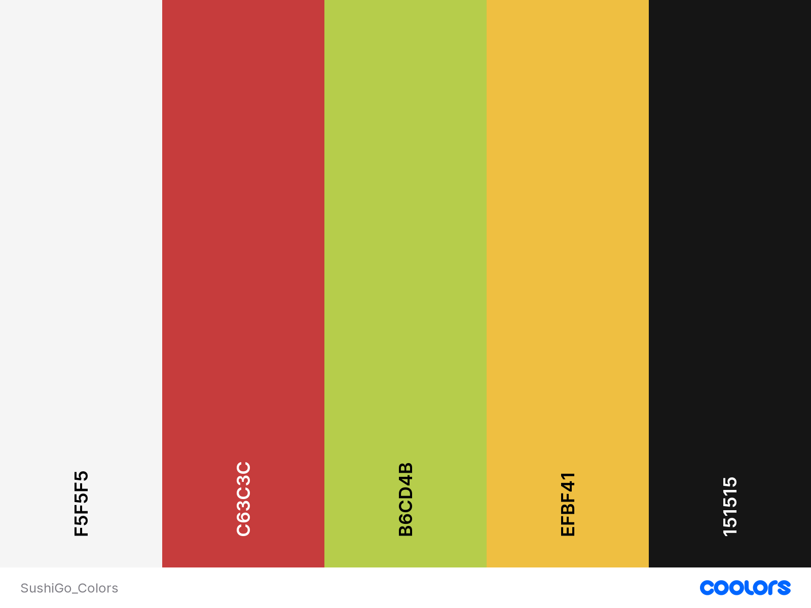

# Charte graphique de Sushi Go

## **Palettes de couleurs**

### Utilisation de la palette de couleurs

Les 6 couleurs de la palette sont : White Smoke, Persian Red, Yellow Green, Silver Lake Blue, Saffron et Night. Leurs codes sont définis plus bas.

Leurs usages sont les suivants :

---

Le **White Smoke** est utilisé pour les gros textes (boutons, titres) sur l'une des couleurs.

Le **Persian Red** sert pour des contours et des valeurs de configurable.

Le **Yellow Green** est utilisé pour des contours.

Le **Saffron** est utilisé pour des backgrounds de usercontrols en général (bouton, border ou usercontrols personnels)

Le **Night** est utilisé pour des textes simples ou bien de fines bordures.

---


### Visuels de la palette



[Plaquette en ligne](https://coolors.co/f5f5f5-c63c3c-b6cd4b-efbf41-151515)


### Codes de références

Hexa :

**White Smoke :** ``#F5F5F5``  
**Persian Red :** ``#C63C3C``    
**Yellow Green :** ``#B6CD4B``  
**Saffron :** ``#EFBF41``  
**Night :** ``#151515``

Palette XML :

```xml
<palette>
    <Color x:Key="WhiteSmoke">#F5F5F5</Color>
    <Color x:Key="PersianRed">#C63C3C</Color>
    <Color x:Key="YellowGreen">#B6CD4B</Color>
    <Color x:Key="Saffron">#EFBF41</Color>
    <Color x:Key="Night">#151515</Color>
</palette>
```


## **Règles divers**

### Police

La police utilisé est **New_Sushi** présent dans le dossier ref.

### Boutons

Faire de boutons arrondies. Pour les couleurs, de background choisir entre **Saffron** ou bien **Persian Red**.

### Autres

Essayer de rendre l'ambiance un minimum kawaï.

